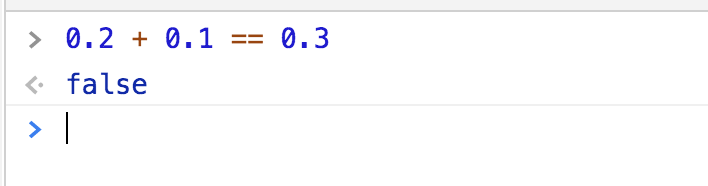

# 0.1 + 0.2 == 0.3 ？

我们把上面这段代码在控制台执行一下，看到结果是false


那为什么结果为false呢？这需要从浮点数值说起

##浮点数值定义
所谓浮点数值，就是该数值中必须包含一个小数点，并且小数点后必须至少有一位数字。小数点前面可以没有整数（但不推荐这种写法）

##浮点数值的几个特点

 - 如果小数点后面没有任何数字，则会当做整数值来保存。因为保存浮点数值需要的内存是保存整数值的两倍，比如10.0会被解析为整数10
 ```
    var floatNum = 10.0   // 会被解析为10
    
 ```
 - 极大或极小的数可以用e表示法（科学记数法）表示
 
 ```
     var floatNumMax = 3.159e7      // 等于31590000
     var floatNumMin = 3e-7        // 等于0.0000003
  ```
 - 浮点数值的最高精度是17位小数，但在进行算术计算时其精度远远不如整数。所以这个特点导致上面提到的为什么0.1 + 0.2 == 0.3 结果为false了。0.1 + 0.2实际结果是0.30000000000000004。
 
最后，关于浮点数值计算会产生舍入误差的问题，这是IEEE754数值的浮点计算的通病，并非JS有这个问题，若其他预约使用相同数值格式的语言也存在这个问题
关于IEEE754浮点数算术详细信息看https://en.wikipedia.org/wiki/IEEE_754

